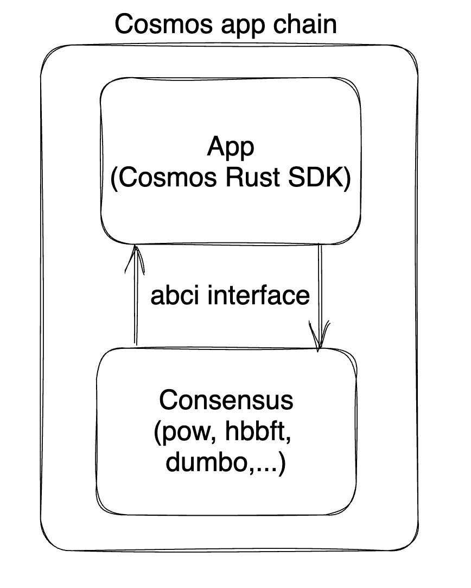

# consensus-abci
This is a minimal viable experiment of replacing the tendermint consensus using ABCI - a demo of POW-tendermint.

## Background
At present, there is no comprehensive replacement consensus mechanism within the Cosmos ecosystem, nor are there any use cases of building apps within the Cosmos ecosystem. We have successfully implemented a relatively comprehensive app that replaces the Cosmos consensus mechanism, with the app component developed using the Rust SDK (Gears).

## Architecture
The following diagram illustrates the technical architecture of this design.



## How to run
### Start with rust sdk
1. clone cosmos rust sdk repo
```shell 
git clone https://github.com/rumos-io/gears
```

2. init the chain
```shell
make init
```

3. build and start the application:
```shell
make run
```

4. open another terminal(before this, you need to install tendermint cli)
```shell
make tendermint-start
```
5. compile the gaia-rs
```shell
make install
```
> make the `gaia-rs` to be a global command

5. import account alice
```shell
echo "race draft rival universe maid cheese steel logic crowd fork comic easy truth drift tomorrow eye buddy head time cash swing swift midnight borrow" | gaia-rs keys add alice --recover
```

6. query with tendermint consensus
```shell
gaia-rs query bank balances cosmos180tr8wmsk8ugt32yynj8efqwg3yglmpwp22rut
```
the result is:
```json
{
  "balances": [],
  "pagination": null
}
```

> If this is ok, we can stop the terminal which run `make tendermint-start`.

### Start consensus
> Now, we can start the current consensus with this repo

1. clone this repo
```shell
git clone https://github.com/DoraFactory/consensus-abci.git
```

2.compile the consensus
```shell
cd consensus-abci && cargo build --release
```

3. start the pow-node
```shell
./target/release/pow-node run
```

### Send tx
> start another terminal

```shell
gaia-rs tx bank send alice cosmos180tr8wmsk8ugt32yynj8efqwg3yglmpwp22rut 1uatom --fee 1uatom
```

### Query tx

```shell
gaia-rs query bank balances cosmos180tr8wmsk8ugt32yynj8efqwg3yglmpwp22rut
```

thre result is:
```json
{
  "balances": [
    {
      "denom": "uatom",
      "amount": "1"
    }
  ],
  "pagination": null
}
```

Now, we have successfully replaced the consensus mechanism and have successfully sent transactions. In the future, if we need additional app functionality, we can fill in the corresponding modules within Gears.

